# Lab 03 Submission

## 1. Repo 連結
[https://github.com/qqwnua/wsse-student-enrollment-labs-2025](https://github.com/qqwnua/wsse-student-enrollment-labs-2025)

## 2. PR 連結
[https://github.com/qqwnua/wsse-student-enrollment-labs-2025/pull/3](https://github.com/qqwnua/wsse-student-enrollment-labs-2025/pull/3)

## 3. API Gateway 基礎設定 (Resources & Stage)
### Resources 樹狀圖 (顯示 /health 與 /students)
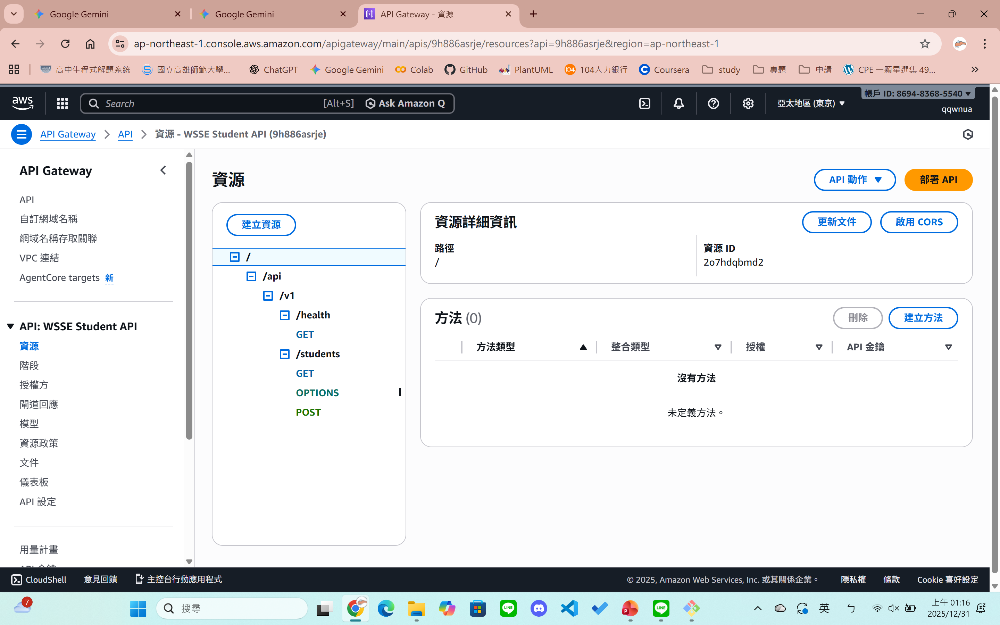

### Stage prod 資訊 (顯示 Invoke URL)
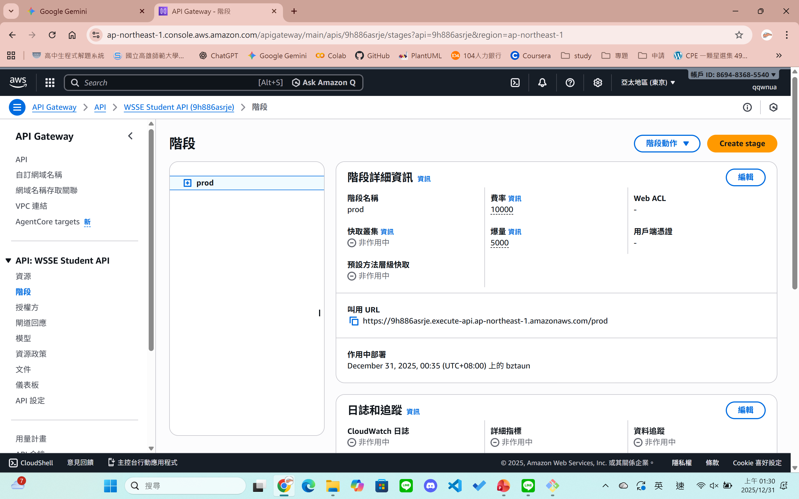

### CORS 設定 (OPTIONS 方法或設定畫面)
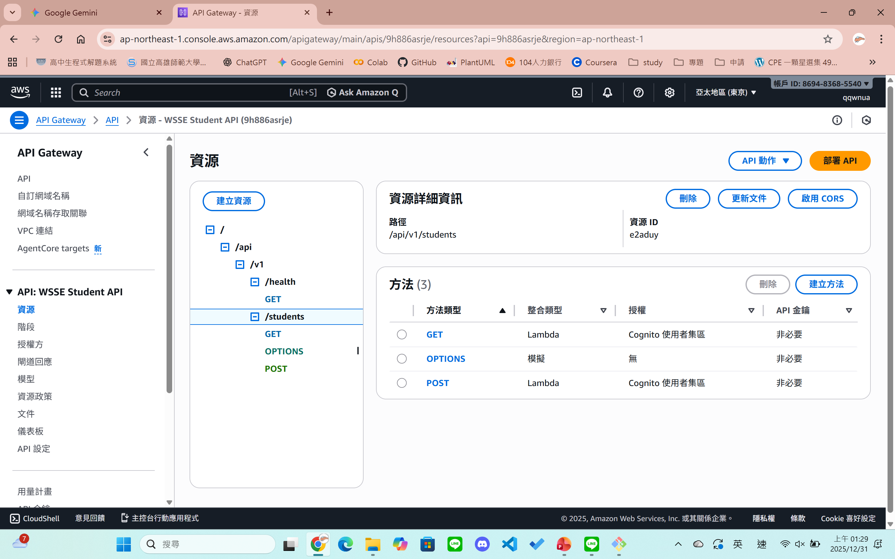

## 4. Lambda 整合設定 (Integration)
### Integration Request: GET /students (連結到 Lambda)
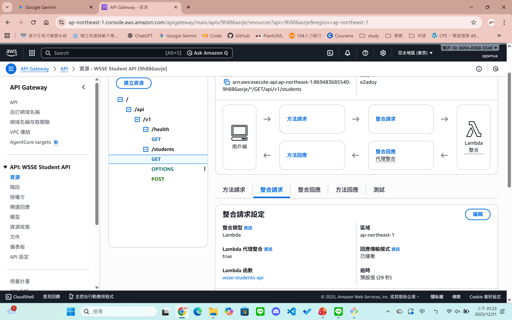

### Integration Request: POST /students (連結到 Lambda)
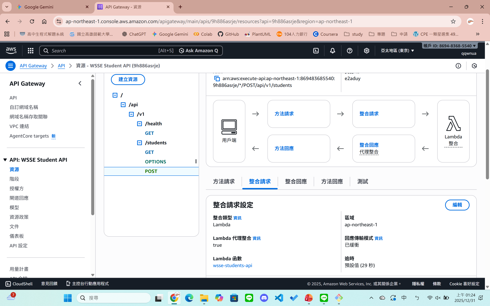

### Integration Request: GET /health (連結到 Lambda)
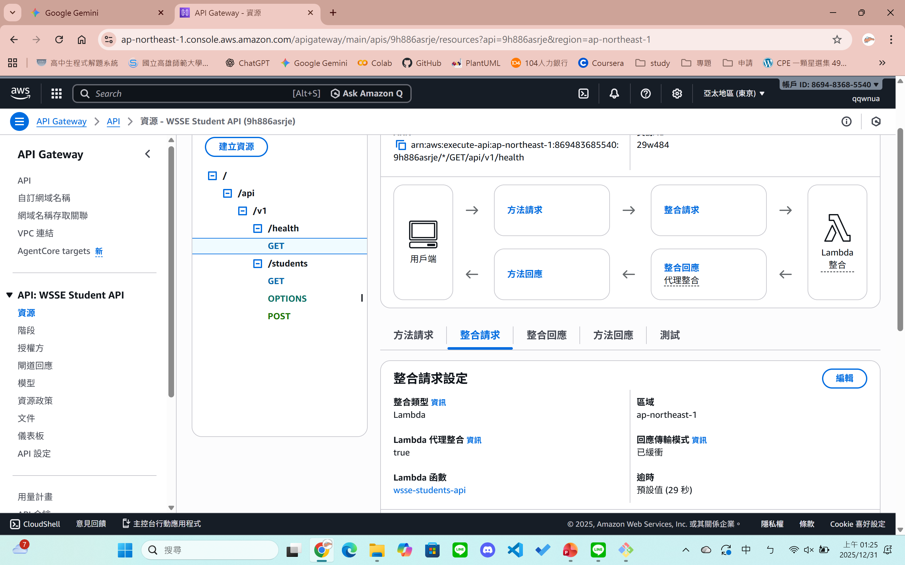

## 5. 安全性與授權設定 (Security & Scopes)
### Authorizer 設定 (Cognito Authorizer)
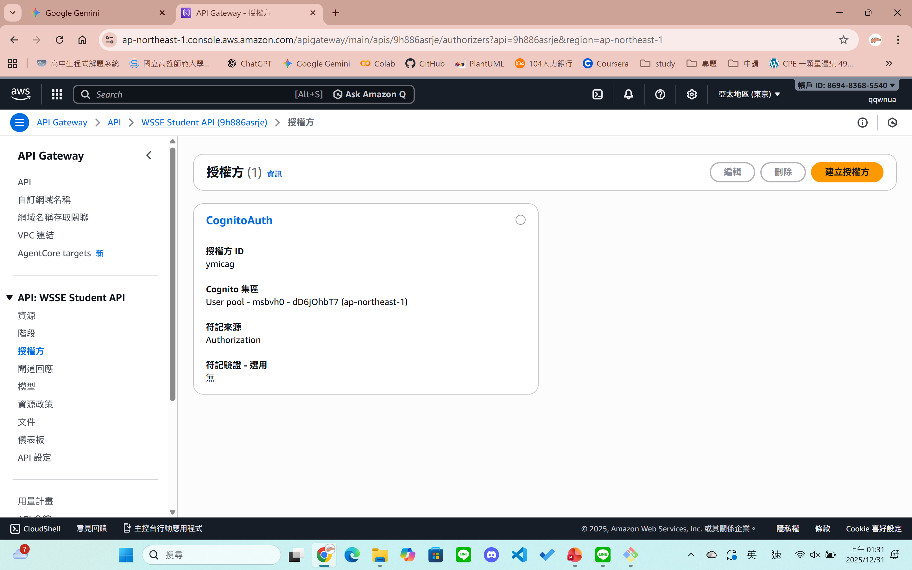

### Scope 設定: GET Method Request (read scope)
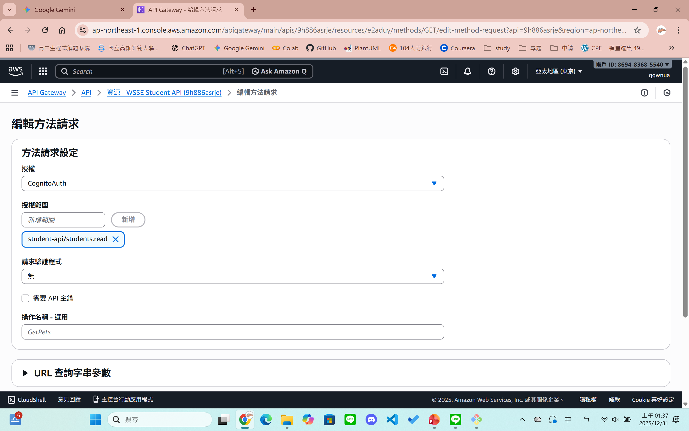

### Scope 設定: POST Method Request (write scope)
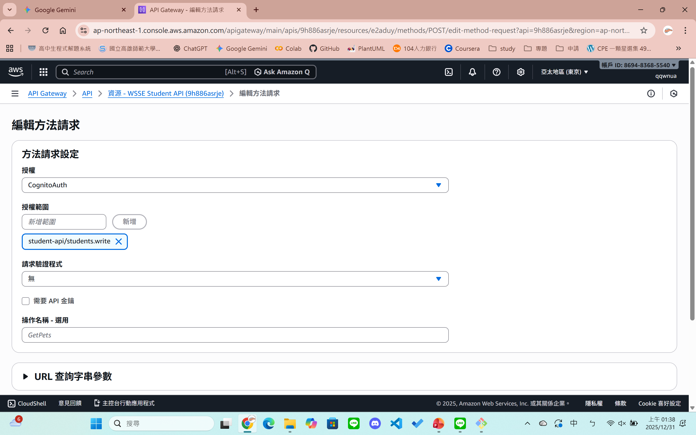

## 6. 測試結果截圖 (Testing Evidence)
### Lambda 內部測試 A: /health (Execution result: succeeded)
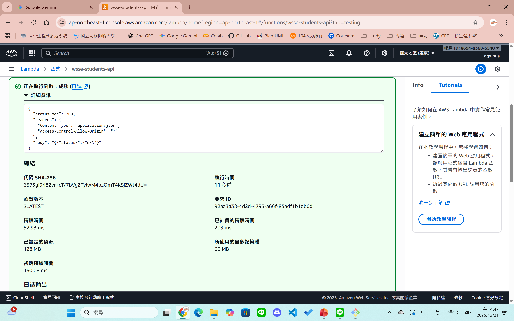

### Lambda 內部測試 B: POST /students (Execution result: succeeded)
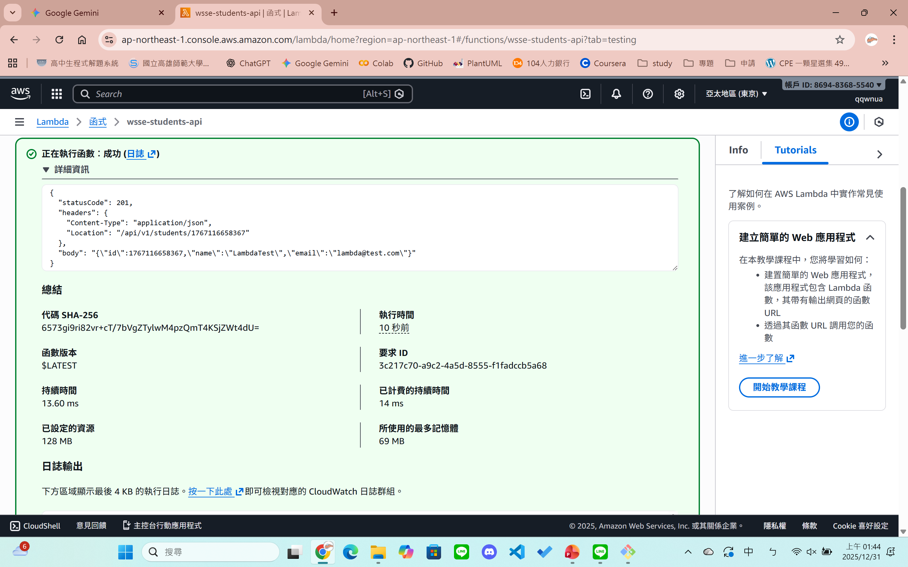

### CloudWatch Logs (證明 Curl 請求已進入)
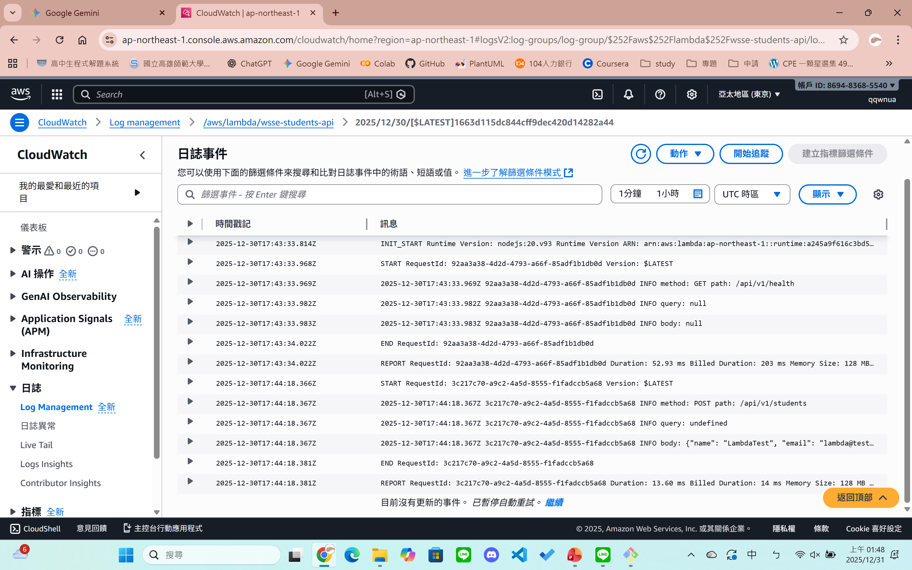