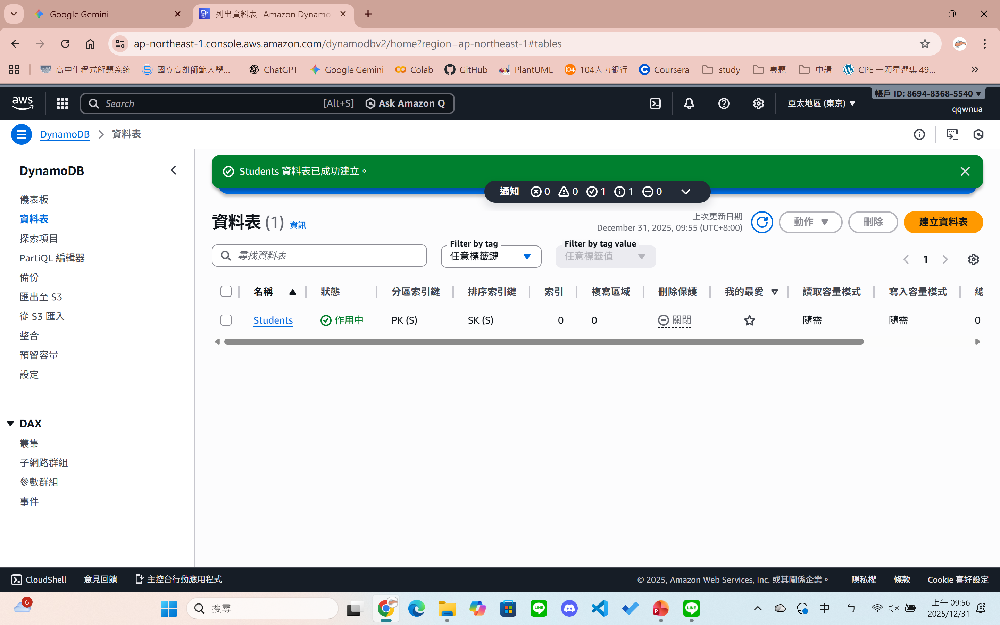
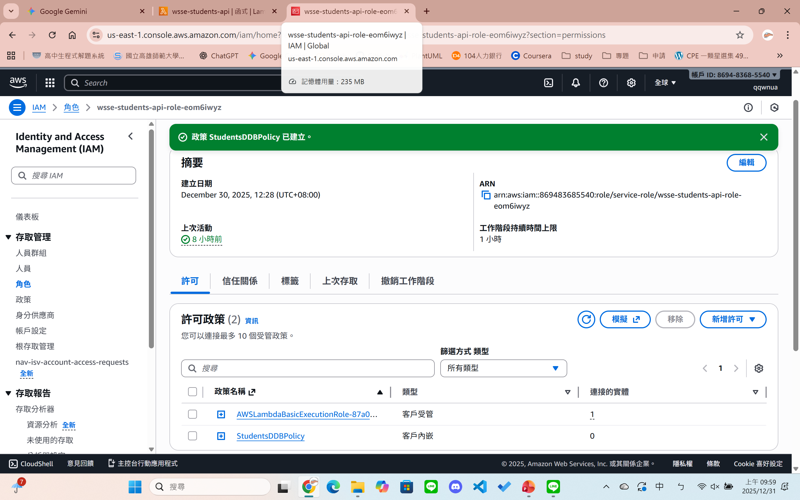
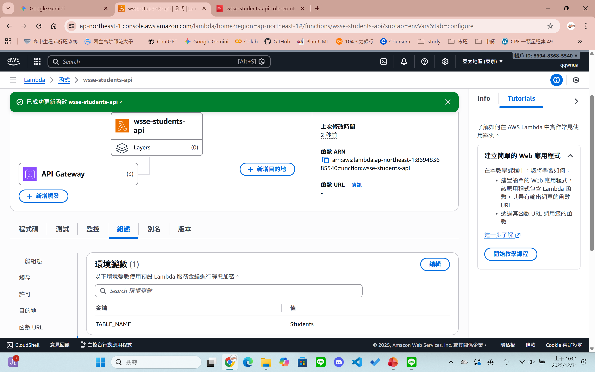
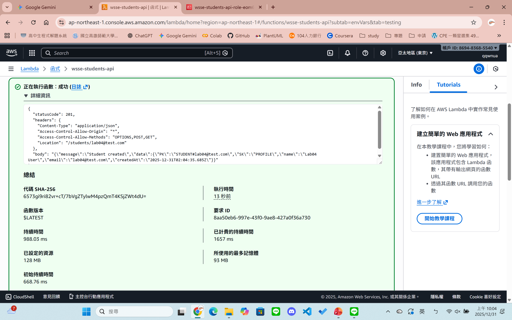
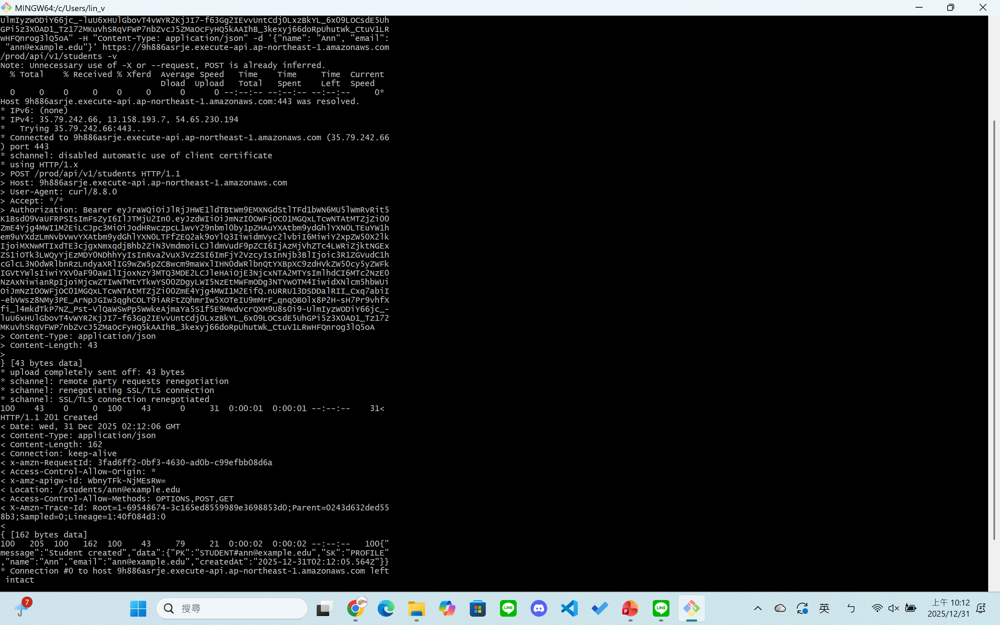
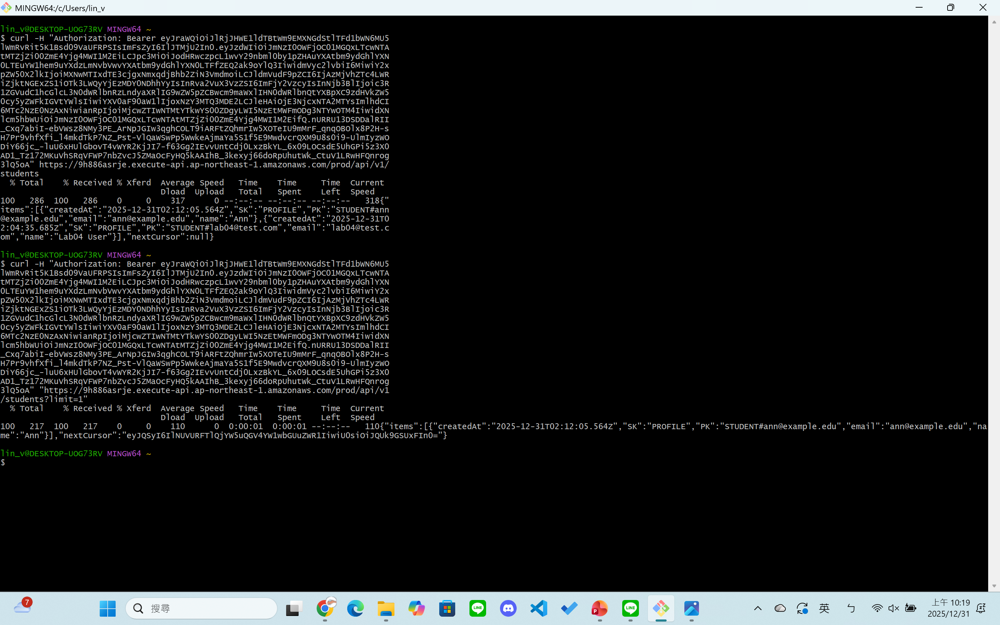
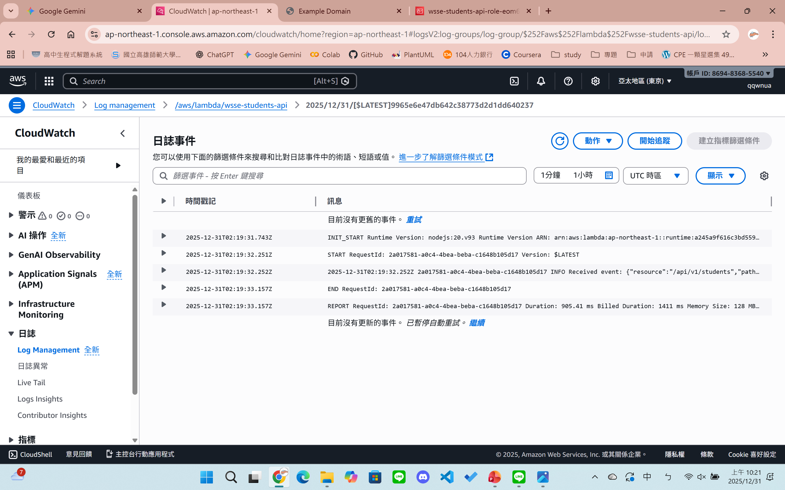

# Lab 04 Submission

## 1. Repo 連結
[https://github.com/qqwnua/wsse-student-enrollment-labs-2025](https://github.com/qqwnua/wsse-student-enrollment-labs-2025)

## 2. PR 連結
[https://github.com/qqwnua/wsse-student-enrollment-labs-2025/pull/4](https://github.com/qqwnua/wsse-student-enrollment-labs-2025/pull/4)

## 3. DynamoDB 設定 (Database)
### DynamoDB 資料表與索引 (Table & Index)

## 4. Lambda 與權限設定 (Config & Security)
### IAM Inline Policy (Least Privilege)

### Lambda 環境變數與 Runtime 設定

## 5. Lambda 內部測試 (Internal Testing)
### 測試事件 POST 成功 (Execution result: succeeded)

## 6. API Gateway 外部測試結果 (External Testing)

### 1) POST 測試 (建立資料)
**預期結果：** HTTP 201 Created + Location Header。

### 2) GET 測試 (讀取資料)
**預期結果：** HTTP 200 OK + items 陣列。

### 3) GET 分頁測試 (Pagination)
**預期結果：** 使用 `?limit=1` 強制分頁，回傳 `nextCursor` (非 null)。

## 7. CloudWatch Logs (Observability)
### RequestId 對照與執行紀錄
