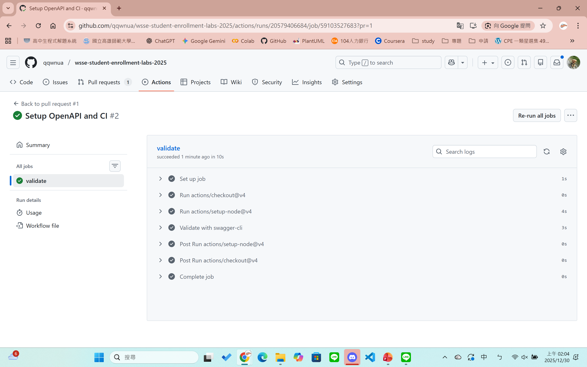

# Lab 01 Submission

## 1. Repo 連結
[https://github.com/qqwnua/wsse-student-enrollment-labs-2025](https://github.com/qqwnua/wsse-student-enrollment-labs-2025)

## 2. PR 連結
[https://github.com/qqwnua/wsse-student-enrollment-labs-2025/pull/1](https://github.com/qqwnua/wsse-student-enrollment-labs-2025/pull/1)

## 3. Swagger Editor 截圖

## 4. PR 綠燈截圖

## 5. CI 內容截圖 (Job log)

## 6. 重點片段連結
* [openapi/openapi.yaml#L50-L60](/openapi/openapi.yaml) - /health GET
* [openapi/openapi.yaml#L65-L80](/openapi/openapi.yaml) - /students GET & POST
* [openapi/openapi.yaml#L25-L35](/openapi/openapi.yaml) - Student Schema
* [openapi/openapi.yaml#L38-L45](/openapi/openapi.yaml) - Error Schema

## 7. Apikey 與 Override
* [openapi/openapi.yaml#L18-L22](/openapi/openapi.yaml) - ApiKey Definition
* [openapi/openapi.yaml#L54](/openapi/openapi.yaml) - /health Security Override
