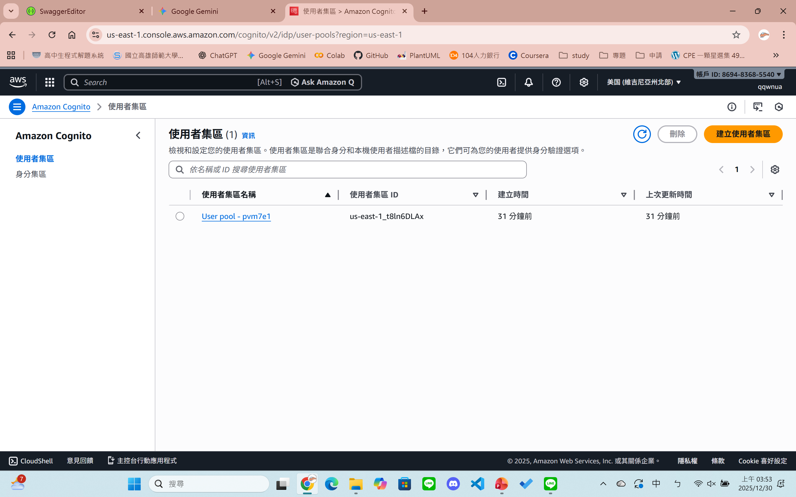
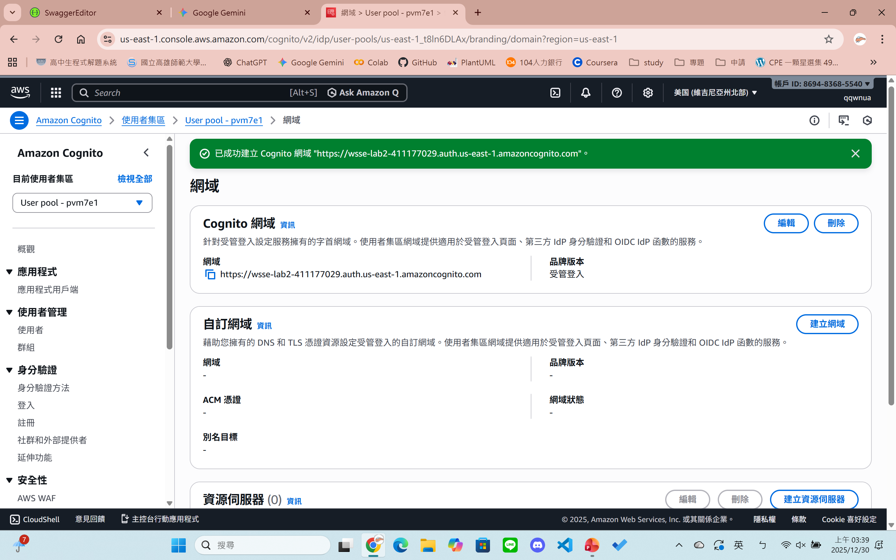
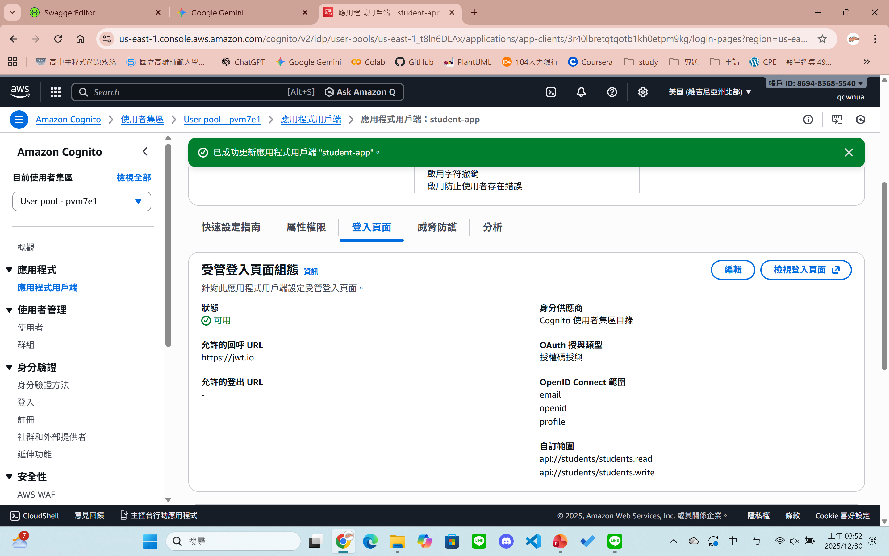
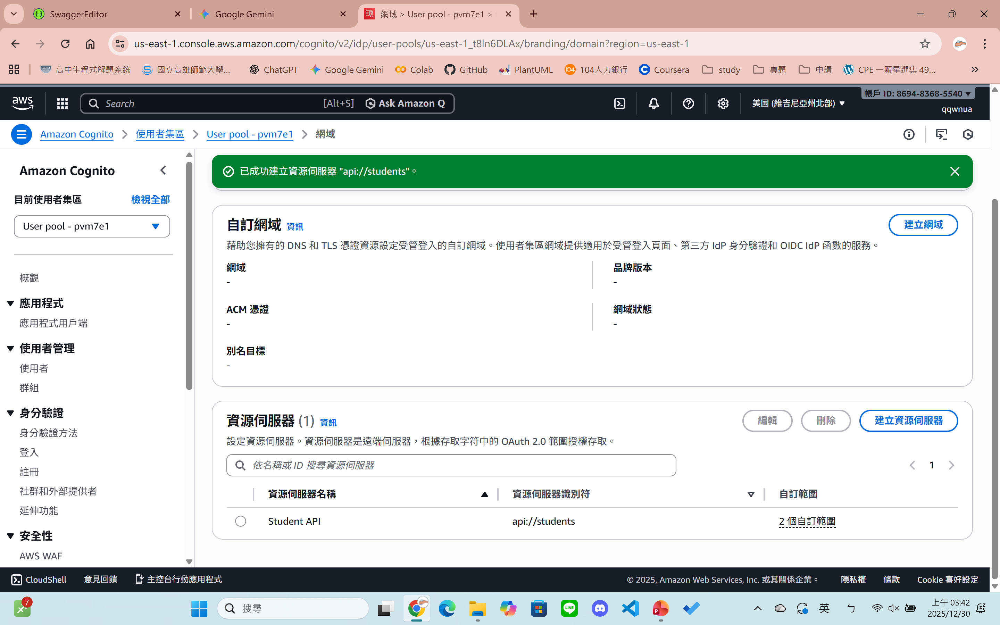
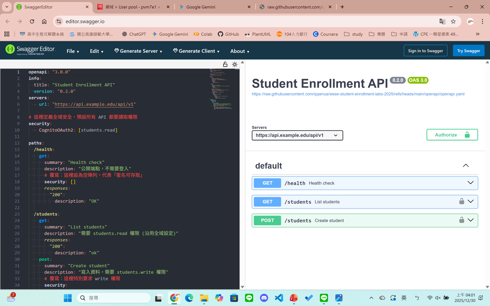
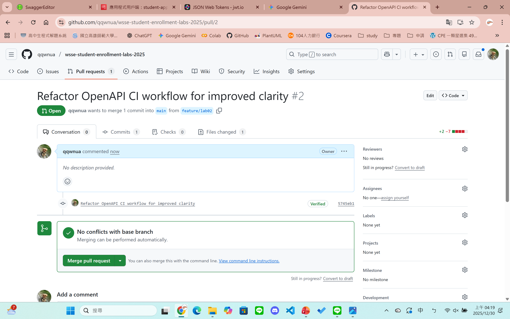

# Lab 02 Submission

## 1. Repo 連結
[https://github.com/qqwnua/wsse-student-enrollment-labs-2025](https://github.com/qqwnua/wsse-student-enrollment-labs-2025)

## 2. PR 連結
[https://github.com/qqwnua/wsse-student-enrollment-labs-2025/pull/2](https://github.com/qqwnua/wsse-student-enrollment-labs-2025/pull/2)

## 3. Cognito 設定截圖
### User Pool 資訊

### App Client Domain

### App Client 詳細設定 (No Secret & Callback)

### Resource Server Scopes

## 4. Token 驗證截圖 (JWT)
### Access Token 解析 (含 Scope)

## 5. CI/CD 截圖
### Swagger Editor 無錯誤驗證

### PR 綠燈截圖

## 6. OpenAPI 重點片段連結
* [openapi/openapi.yaml](/openapi/openapi.yaml) - OAuth2 Security Scheme Definition (components)
* [openapi/openapi.yaml](/openapi/openapi.yaml) - Global Security Requirement (security)
